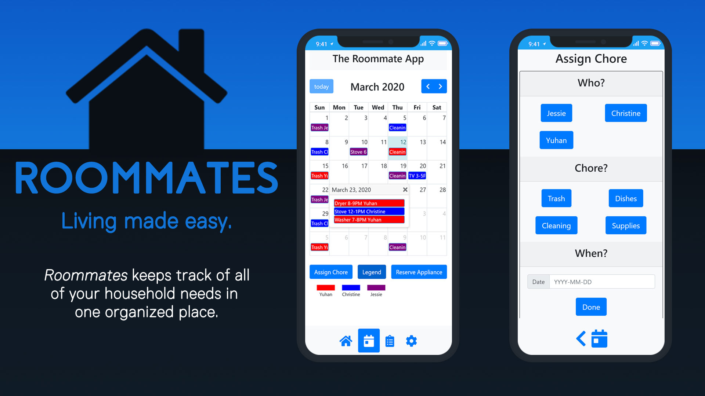

# Roommate App
UCSD - Cogs 120: Interaction Design (Winter 2020)

## Collaborators:
* Christine Chung 
* Yuhan Zhang
* Jessie Cruz 

## Digital Poster


## Links
* Web Application: http://roommate-app-ucsd.herokuapp.com/home
* Prototype Walkthrough: https://www.youtube.com/watch?v=kYn6910DrLY
* Course Website: http://ixd.ucsd.edu/home

## Resources

**Bootstrap v4.0**
* Documentation: https://getbootstrap.com/docs/4.0/getting-started/introduction/#quick-start

**Node.js**
* https://nodejs.org/en/docs/

**jQuery**
* https://api.jquery.com/

**Heroku**
* https://www.heroku.com/

**Icons**
* Font Awesome: https://fontawesome.com/icons/
* Example (Home Icon):
```html
<i class="fas fa-home"></i>
```

**Calendar API**
* FullCalendar: https://fullcalendar.io/docs
* Demo: https://fullcalendar.io/docs/bootstrap-theme-demo

**Clipboard.js**
* clipboard.js: https://clipboardjs.com/

**Google Material Design Icons**
* Website: https://material.io/resources/icons/?style=baseline
* Guide/Docs: https://google.github.io/material-design-icons/
